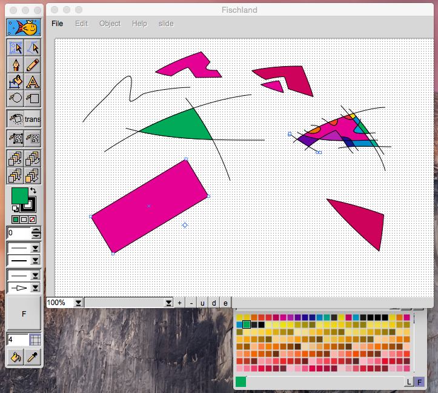
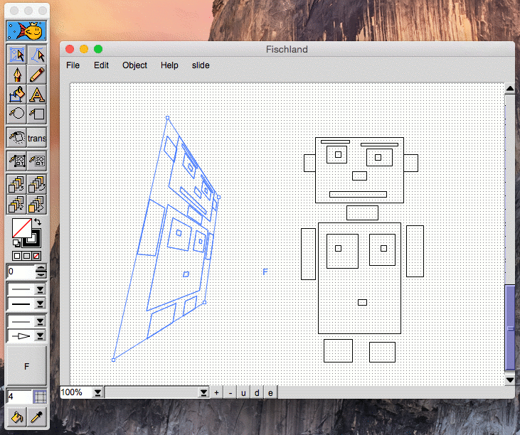
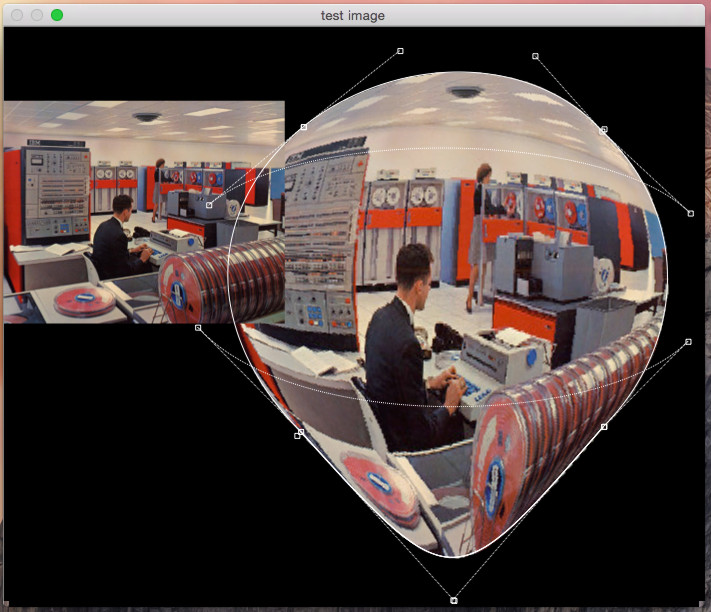
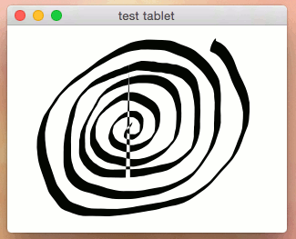
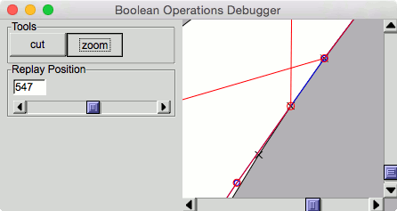

# TOAD macOS & Fischland Vector Graphics Editor

This repository contains the unfinished macOS port of the TOAD C++ GUI library and the Fischland Vector Graphics Editor in the subdirectory fischland/.

* TOAD for X11 can be found here https://github.com/markandre13/toad-x11
* TOAD for the Web can be found here https://github.com/markandre13/toad.js
* Fischland's successor can be found here https://github.com/markandre13/workflow

### Vector Deformation Experiment

### Bitmap Deformation Experiment

### Pencil Experiment

### Debugging Boolean Operations Code
